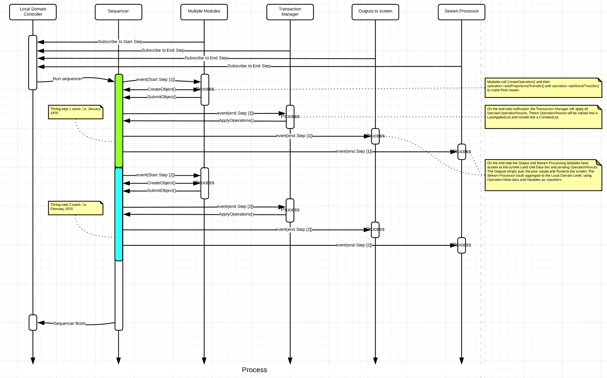
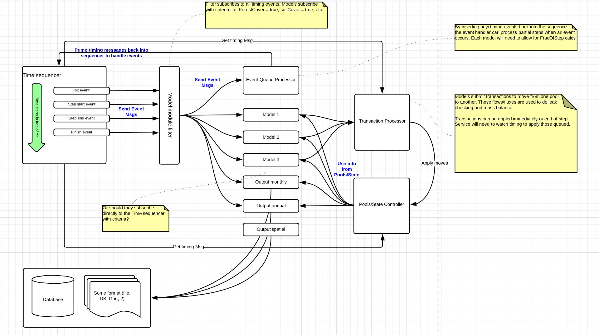

## Frequently asked questions about the Modules in FLINT

**Q:**  Do Modules need a specific version to run? 

**A:** The modules work with the [`develop`](https://github.com/moja-global/FLINT/tree/develop) branch of the **FLINT**. The actively maintained modules work with the most recent version (and are likely broken with old enough builds of the FLINT).  
The API has evolved a bit over time, so some modules might have fallen out of date but nothing requires a custom fork of FLINT.

##
**Q.** Why are Modules important?

**A.** Without the modules, the FLINT cannot produce outputs. Each user will have different data and policy and reporting needs. Based on these needs users will attach the appropriate modules and data to the FLINT. 

## 
**Q:** Where can I learn more about modules?

**A:** For getting a deep understanding of modules, you have to understand how things work inside a module and what are the different operations used in FLINT and how it is being managed and developed.  
Here is the [link](https://github.com/moja-global/FLINT.Modules.docs/blob/develop/modules.md) for an advance level of module documentation.
##

**Q.** Can I implement a module from scratch?

**A.** Here's an example of a custom made module - [**Agricultural soil module**](https://github.com/moja-global/FLINT.Module.Agricultural_Soil_Model).   
This project involves specifically implementing the agricultural soils model that is used to estimate non-CO2 GHG emissions from agricultural practices.   
You can visit this [link](https://github.com/moja-global/FLINT.Modules.docs/blob/develop/modules.md#developing-modules) to know how to implement a single, simple module from scratch.

##
**Q.** How do modules interact with each other?

**A.** Different Modules are configured through Local Domain Controller and sequencer which decides the flow of modules.   
Here is a **Sequence diagram** for better understanding.

    

Here is a **Control Flow diagram** of modules.

### Template:   
**Q:**   
**A:**

##
If you have more questions related to modules you can reach out to us via [Email](mailto:info@moja.global) or on [slack](https://join.slack.com/t/mojaglobal/shared_invite/zt-o6ta1ug0-rVLjAo460~d7JbZ~HpFFtw ).