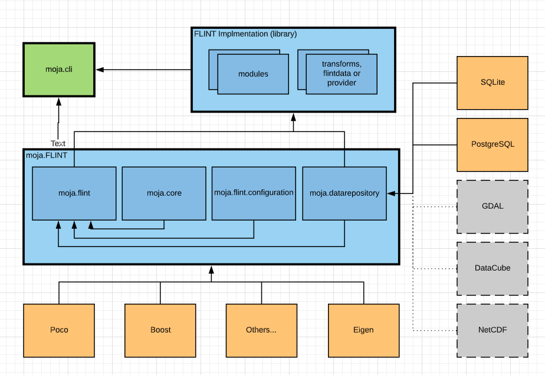

These are the prerequistes you need to know before learning about **Modules**. This document presumes that you are already familiar with **FLINT**. If not, see [link](https://github.com/moja-global/FLINT) to better understand **FLINT** before continuing.

1. **Pools**
  
    A pool is a reservoir within which something can be stored and released. 
   
    For example, a carbon pool is a reservoir from which carbon can be stored (sequestered and/or maintained) or emitted, such as debris. Within FLINT, each pool has attributed a value such as tonnes carbon, and at each time step, the FLINT can move stores from one pool to another using an operation.

    Here are the different pools present in FLINT. 

    

    [IPCC](https://www.ipcc.ch/about/) : The **Intergovernmental Panel on Climate Change** (IPCC) is the United Nations body for assessing the science related to climate change.  
    FLINT has been designed to follow the IPCC Good Practice Guidance and the evolving transparency framework under the Paris Agreement. The approach is solidly rooted in science and applies a carbon balance method to ensure the generated results are reliable. 

2. **Operations**
  
    An operation is a process within FLINT that moves carbon stock between pools.         
    Operations can reflect ongoing natural processes, such as growth, or specific events, whether natural or human-induced.

    Operations allow FLINT to track changes in carbon stock through time, including fluxes into and out of pools.

    For example, a harvest moves plant material to products and debris pools, whereas a wildfire moves plant material to debris and atmosphere pools.

3. **Events**
    
    Events are operations that occur intermittently (rather than for every time step in a simulation) resulting in the movement of carbon from one pool to another.  
    Events include natural and anthropogenic events including: fire, harvesting, ploughing, and fertiliser application. These are coded for the FLINT as a module.

    Here is the relationship between Pools and Operations/ Events.

    

4. **Modules**

    Modules are the building blocks of FLINT. They contain the operations that describe the ecological processes driving carbon changes in the landscape.

    This document provides information regarding the major modules present in FLINT.

5. [**Tiers of Module**](https://community.foundationfootprint.com/FoundationFootprintHelpCentre/Miscellaneous/IPCCTiers.aspx#:~:text=Tiers%20of%20Emission%20Factors%20and%20Activity%20Data&text=A%20tier%20represents%20a%20level%20of%20methodological%20complexity.&text=Tier%201%20is%20the%20basic,of%20complexity%20and%20data%20requirements.)

    All the modules are divided into three different tiers according to the amount of information required, and the degree of analytical complexity.  

    Three tiers are described for categorizing both emissions factors and activity data. 
    Tier 1 is the basic method, frequently utilizing IPCC-recommended country-level defaults. While Tiers 2 and 3 are each more demanding in terms of complexity and data requirements.

6. [**Temporal Distribution**](https://github.com/moja-global/FLINT/wiki/1.7-Temporal-Distribution)

    The temporal scale in FLINT is referred to as time-steps. Time-steps are lengths of time over which operations are reported. It is only at the end of a time-step that carbon can be moved from one pool to another.

    The standard time-step in FLINT is one month. However it can be varied by the user. One month is the recommended time-step for modelling carbon.

7. **Simulation Units**

    A Simulation Unit is a unit for which a module is applied. A Simulation Unit can represent a spatial area, such as a pixel or forest stand, or it can represent an emissions source, such as livestock.    
    Where the Simulation Unit refers to a geographically referenced area, it is known as a Land Unit.

    The overall framework of FLINT manages the processing of Simulation Units over time. Simulation Units are the basis of all simulations run in FLINT.

8. **Synchronized Events**

    In some circumstances, modules that are simulated for a particular Simulation Unit are dependent on other Simulation Units. That is, there is an interdependency between the Simulation Units.   
    In these situations it is necessary for there to be a process that synchronizes across the related Simulation Units and this is known as synchronized events.
    
    The Synchronized Server in FLINT manages Synchronized events.

9. **Mass Balance**

    The carbon cycle is based on the transfer of carbon molecules from one pool to another, where the molecules are not created, nor are they destroyed.  
    As such, all outputs must be equal to the inputs. The system must be in balance. This is referred to as mass balance.

Overall this is the high level design of FLINT.  

