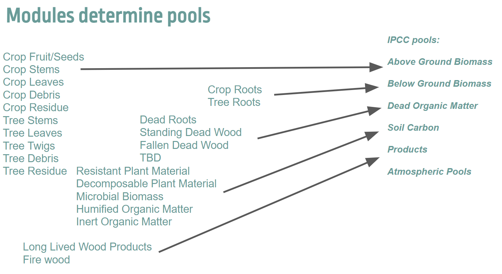
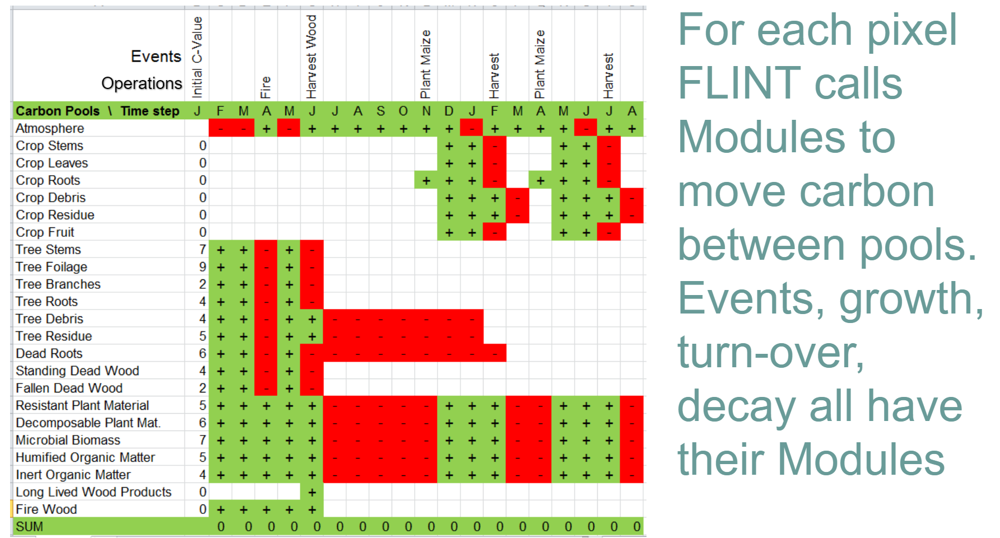

1. Pools
  
    A pool is a reservoir within which something can be stored and released. 
   
    For example, a carbon pool is a reservoir from which carbon can be stored (sequestered and/or maintained) or emitted, such as debris. Within FLINT, each pool has attributed a value such as tonnes carbon, and at each time step, the FLINT can move stores from one pool to another using operation.

    Here are the different pools present in the FLINT. 

    

2. Operations
  
    An operation is a process within the FLINT that moves carbon stock between pools. 

    These are also known as the Events in the FLINT.
    
    Operations can reflect ongoing natural processes, such as growth, or specific events, natural or human-induced.

    For example, a harvest moves plant material to products and debris pools, wildfire moves plant material to debris and atmosphere pools.

    Here is the relationship between Pools and Operations/ Events.

    

