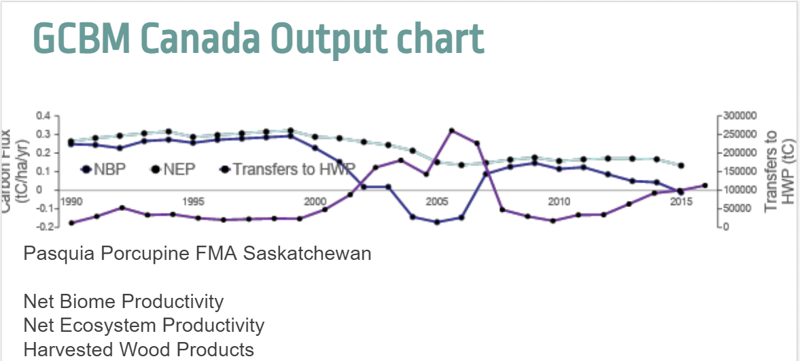
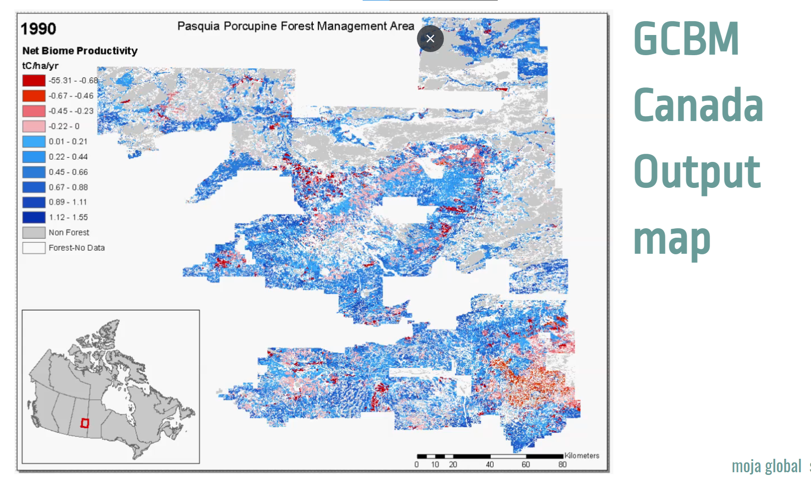

# GCBM Module

The GCBM (Generic Carbon Budget Model) is a combination of the FLINT platform with the science modules developed by the Canadian Forest Service (CFS).

These are the same science modules used in the first generation tool ([CBM-CFS3](https://www.nrcan.gc.ca/climate-change/impacts-adaptations/climate-change-impacts-forests/carbon-accounting/carbon-budget-model/cbm-cfs3/13089)). Since the science and processes behind both tools are very similar, it is relatively easy to transition from CBM-CFS3 to GCBM.

The CBM-CFS3 is widely used throughout Canada and globally and its use is supported by the Canadian Forest Service of Natural Resources Canada.

The next generation GCBM is currently used by the CFS with a number of partner organizations to advance the science of forest carbon estimation and to support policy analyses such as the assessment of mitigation options in the forest sector.

In GCBM, forest inventory and disturbance events are spatially explicit. The location of disturbances are explicit in spatial layers instead of rule based. The GCBM Module is able to simulate large landscapes easily.


It is one of the Country specific modules designed especially for Canada.

It works at the **Annual Time step** interval.

There is a special repository for the GCBM Module [Here](https://github.com/moja-global/moja.canada/tree/develop).

***PREREQUISITE MODULES FOR GCBM:*** 

There are numerous prerequisites for the GCBM and we have only included a short summary of these modules.


1. **The Canadian Model for Peatlands (CaMP)** 
    
    The Canadian Model for Peatlands (CaMP) is a module for Greenhouse Gas Emissions.

    The CaMP was designed as a module for the spatially-explicit Generic Carbon Budget Model (GCBM) that is intended for future reporting of Greenhouse gas (GHG) emissions and removal estimates from Canada's managed forest area. 

    The Canadian Model for Peatlands (CaMP) is a site- to national-level peatland carbon model developed to better estimate greenhouse gas (GHG) emissions across a range of peatland types within Canada.

    Different events are fired on the basis of different land type found during simulation.
    like If peatland land type is encountered then fires peatland disturbance event else it fires a regular CBM disturbance event.

    For More information regarding CaMP check out this [Document](https://www.sciencedirect.com/science/article/pii/S0304380020302350).

2. **Decay Module**

    This Module performs the annual decay and turnover on a set of dead organic matter pools present in the GCBM.
    Data Requirements for the Decay Module are as :
    
    - A table named "decay_parameters" with one set of decay parameters for each of the enumerated dom pools in the DomPool.

    - Scalar "mean_annual_temperature" is the mean annual temperature of the environment.

    - Scalar "SlowMixingRate" the amount turned over from slow aboveground to slow belowground annually.

3. **Moss Decay Module**

    This module is used for moss related computing, that is whether the moss pool is decaying or not.
    
    It uses various mathematical equations to apply decay rates to the different moss pools.

4.  **Moss Disturbance Module**

    This module responds to the fire disturbance events in CBM.
    
    This module is responsible for transferring carbon content from Moss pools to the Greenhouse gases pools.
    
    It gets the input data from the variable ```moss_fire_parameters```.

5. **Moss Growth Module**

    This module is responsible for the growth of moss pools that is it increments the moss growth with the help of mathematical equations, various parameters and moss pools.

6. **Moss Turnover Module**

    This module is responsible for the turnover of moss pools that is from the moss live pool to the moss past pool.
    
    It accurately calculates the amount of turnover moss by taking moss live amount and transfer rates into consideration and by applying transfer events. 

7. **Peatland after CBM Module**

    This module is triggered after CBM simulation on a land unit, and prepares the land unit to simulate the peatland simulation.

    It transfers carbon from some CBM pools to  the peatland pools. 
    
    It is called after finishing the regular CBM simulation.

8. **Peatland Decay Module**

    This module is responsible for Peatland decay.
    
    It gets the data by variable ```peatland_decay_parameters```, ```peatland_turnover_parameters``` and also accounts in various parameters like mean annual temperature, annual water table depth, total initial carbon and transfers the pool's content accordingly.

    It also uses a special turnover rate for various pools like carotelm pool.

    It sets the turnover rate for diffrent pools by taking into acoount of values of varoius greenhouse gases.

9. **Peatland Disturbance Module**

    This module responds to the historical and last disturbance events in the CBM spinup.
    
    It alters the water table depth according to the disturbance type and Peatland Id. 

10. **Peatland Growth Module**

    This module gets the data from the ```peatland_growth_parameters```, ```peatland_turnover_parameters``` and ```peatland_growth_curve```.
    
    It simulates the various growth cycles, growth curves and also sets the component value for the pools like woody layer, moss layer and many more. 

11. **Tree Growth Module**

    This module deals with the small trees growth curve ID like black spruce.
    
    There is a peatland pre-defined forest growth curve of black spruce.
    
    It takes the current eco boundary variable name and then checks if it was changed or just set and as output, it updates the small tree growth curve parameter.
    
    It calculates the biomass transfer between various tree pools like stem wood, coarse root, etc with the help of the age of the small tree.


12. **Stand Maturity Module**

    This module creates the stand growth curve. In short, it gets the standard growth curve ID associated with the pixel, processes it and converts the yield volume to carbon curves.

13. **Tree Yield Table Module**

    A yield table is a table in tabulated form which indicates the volume of wood per unit area of forest which is expected to be at different ages of the trees.

    This module creates the yield tables for multiple hardwood and softwood species components depending upon the age of the tree, species type and specied ID of the tree.

    It also gives a summary of total volume of the speciese growth curve, creates a yield table for a specified type with the transform result yield data.

14. **Yield Table Growth Module**

    This module creates and updates yield tables for different land types like Peatland and Moss and also transfers content between various biomass pools.
    
    It requires the growth yield curve to start working which it gets from the stand growth curve factory file.
    
    It also performs turnover and decay of different pools in its one time step.


15. **[Turnover Module](https://github.com/moja-global/Google.Season.of.Documentation/blob/master/modules-development/turnover-module.md)**

16. **[Decomposition Module](https://github.com/moja-global/Google_Season_of_Documentation/blob/master/modules-development/decomposition-module.md)**


**INPUT:**

There are no specific inputs to the GCBM Module, it contains several modules which have multiple inputs and they all interact with each other to produce the Output of GCBM(maps and tables).

**OUTPUT:**

GCBM gives us the estimate of carbon flux generated, Aboveground Biomass etc.

It can be shown in the form of chart as : 



Output of GCBM can also be visualized in the form of a map such as : 



Also, there is a special repository just to visualize the output generated by GCBM [Taswira](https://github.com/moja-global/GCBM.Visualisation_Tool).